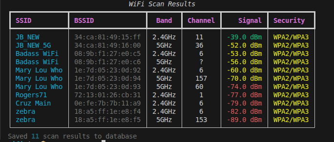

# WiFi Test Utility

Lightweight CLI for scanning WiFi networks, running speed tests (Ookla / iperf3),
saving results to a local SQLite database, and exporting CSVs.

## Installation

```bash
poetry install
```

# Usage

```bash
# Initialize default config (auto-detects wifi interface when possible)
wifi-test config init

# Manage config values
wifi-test config set DB_PATH /path/to/wifi.db
wifi-test config get

# Scan networks (use --save to persist results when supported)
wifi-test scan --save

# Run a speedtest
wifi-test speedtest
wifi-test speedtest --auto-connect -p <PREFIX>
wifi-test speedtest --udp    # use UDP mode for iperf3

# Export combined data to CSV (prompts if no -o)
wifi-test export -o wifi_export.csv
```

What it does

- Scans WiFi networks and displays a rich, colorized table.
- Runs speed tests using either Ookla or iperf3 (configurable).
- Auto-connect mode: scans, connects to matching SSIDs, runs tests, and restores the original network.
- Persists results to an SQLite DB (configurable via `DB_PATH`).
- Export merges `scan_results` and `speedtest_results` into a single CSV with a `record_type` column.

Notable behavior and validations

- Entry point: `wifi-test` (console script mapped to `wifi_test.cli:cli`).
- `SPEEDTEST_TOOL` supports `ookla` (aliases: `speedtest`, `ookla`) and `iperf3` (aliases: `iperf`, `iperf3`) only; invalid values are rejected.
- Boolean config keys (`SCAN_FLUSH`, `AUTO_SAVE`) accept `true|false`, `1|0`, `yes|no` (case-insensitive) and are normalized.
- `IPERF3_PORT_RANGE` must be `start-end` with ports in 1–65535 and start ≤ end.
- `OUTPUT_DIR` and the parent directory of `DB_PATH` are created if missing and must be writable; the DB file itself is created lazily on first write.
- `scan_results` uses `bssid` as a UNIQUE key; scanning/upserting keeps the latest row per device (no duplicate device rows).
- `speedtest` results record which tool ran (`ookla` or `iperf3`).

## Configuration Options

- `DB_PATH`: Path to SQLite database (default: wifi_data.db).
- `WIFI_INTERFACE`: WiFi interface name or `auto` for auto-detection (default: `auto`).
- `SPEEDTEST_TOOL`: Tool to use for speed tests — `ookla` or `iperf3` (default: `ookla`).
- `IPERF3_SERVER`: iperf3 server address (required if using `iperf3`).
- `IPERF3_PORT_RANGE`: iperf3 server port range as `start-end` (e.g., `5201-5210` or `5201-5201`).
- `IPERF3_BANDWIDTH`: Bandwidth string for iperf3 UDP tests passed to `-b` (e.g., `100M`). Default: `100M`.
- `SCAN_FLUSH`: Whether to flush scan cache before scanning (default: `True`).
- `OUTPUT_DIR`: Directory for CSV exports (default: `.`).
- `AUTO_SAVE`: Whether to automatically save scan results to database (default: `True`).
- `PREFIX`: SSID prefix filter for scanning (optional, e.g., `TP-LINK`).
- `PREFIX`: SSID prefix filter for scanning (optional, e.g., `TP-LINK`). To clear any configured prefix and test all scanned networks with `--auto-connect`, set the config value to an empty string, for example:

```bash
wifi-test config set PREFIX ""
```
- `GOLDEN_CONFIG_PASSWORD`: Password for golden config networks (optional).

## CLI Dependencies

The following system tools are required for full functionality:

- `iw` — used for WiFi scanning and interface operations.
- `speedtest` — Ookla Speedtest CLI (when `SPEEDTEST_TOOL` is `ookla`).
- `iperf3` — used when `SPEEDTEST_TOOL` is `iperf3` (supports TCP and UDP).

On Debian/Ubuntu you can install them with:

```bash
sudo apt update && sudo apt install -y iw iperf3
# Ookla speedtest CLI install (official instructions):
# https://www.speedtest.net/apps/cli
```

## Tool Preview


### 📺 Walkthrough Demo (2 mins)
<details>
  <summary>Click to expand video demo</summary>
  
  https://github.com/vajraccedika/wifi-test/raw/main/assets/wifi-test_demo.mp4

</details>

Permissions

- Many commands require root privileges (network operations). The CLI checks and errors if not run with sudo.

Extensibility

- The config system supports aliases and canonical names; more validations or aliases can be added centrally in `wifi_test.config`.